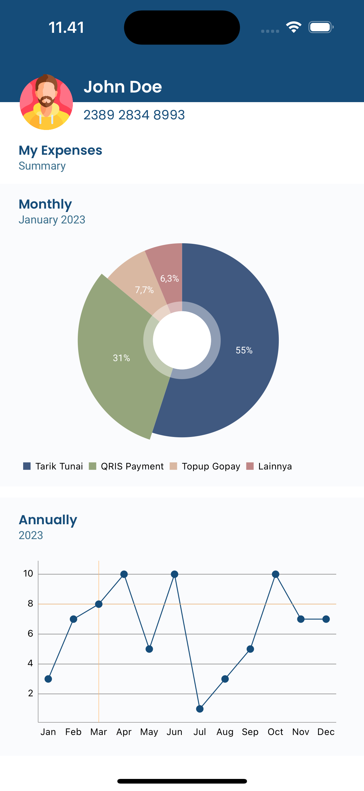
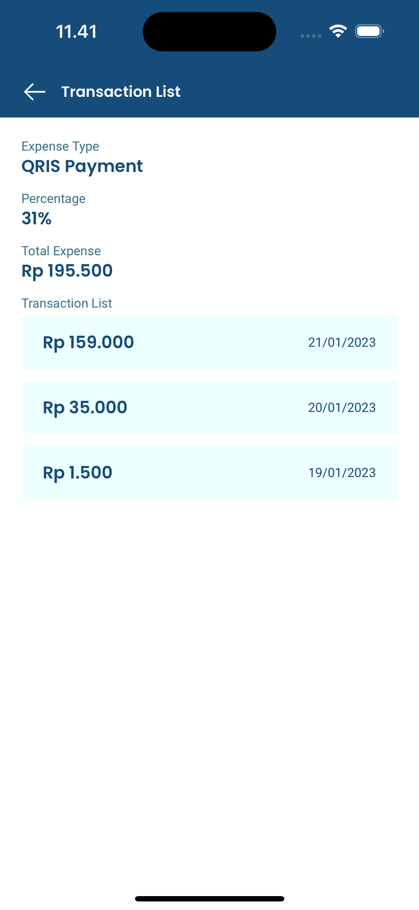

# Maexpense

Maexpense is a simple application designed to help users track their expenses. This app allows users to view yearly, monthly, and detailed expenses based on expense types.

## Features
- View yearly expenses
- View monthly expenses
- View detailed expenses by specific expense types

## Technology
- Swift
- UIKit
- Xcode
- Unit Test
- CocoaPods
- VIPER Design pattern
- DGCharts

## How to Build the Code
1. Make sure Xcode is installed on your device.
2. Ensure CocoaPods is installed on your system. If not, install it with the command `sudo gem install cocoapods`.
3. Open Terminal and navigate to the directory where your project is located.
4. Run the command `pod install` to download and install the required dependencies.
5. Open the project file `.xcworkspace` using Xcode.
6. Select a simulator or device to run the application.
7. Press the "Run" button (▶️) in Xcode to build and run the application.

## Screenshot
 
